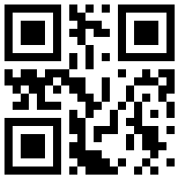
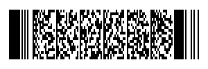
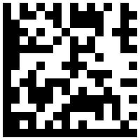

# Go_barcode_ex
https://github.com/boombuler/barcode

## Qrcode
```go
qrcode, _ := qr.Encode("Hell world",qr.Q, qr.Auto)
	qrcode, _ = barcode.Scale(qrcode, 200,200)
	file, _ := os.Create("./output/Qrcode.png")
	defer file.Close()
```


[Qrcode Error_correction_level](https://www.qrcode.com/ko/about/error_correction.html)   
크기는 1:1비율이다. EC 레벨은 L < M < Q < H 순으로 보통 M을 주로 쓴다.

## PDF417
```go
pdf417, _ :=pdf417.Encode("Hell world", 5)
	pdf417, _ = barcode.Scale(pdf417, 300,100)
	file2, _ := os.Create("./output/pdf417.png")
	defer file2.Close()

	png.Encode(file2, pdf417)
```


[PDF417 Error_Correction_level](https://www.barcodefaq.com/2d/pdf417/#Error_Correction_Levels)   
크기는 3:1비율이다.  
EC 레벨은 0~8까지이며 주로 2를 사용한다.

## Matrix
```go
matrix, _ := datamatrix.Encode("Hell world")
	matrix, _ = barcode.Scale(matrix, 200,200)
	file3, _ := os.Create("./output/matrix.png")
	defer file3.Close()

	png.Encode(file3, matrix)
```


크기는 1:1비율이다.